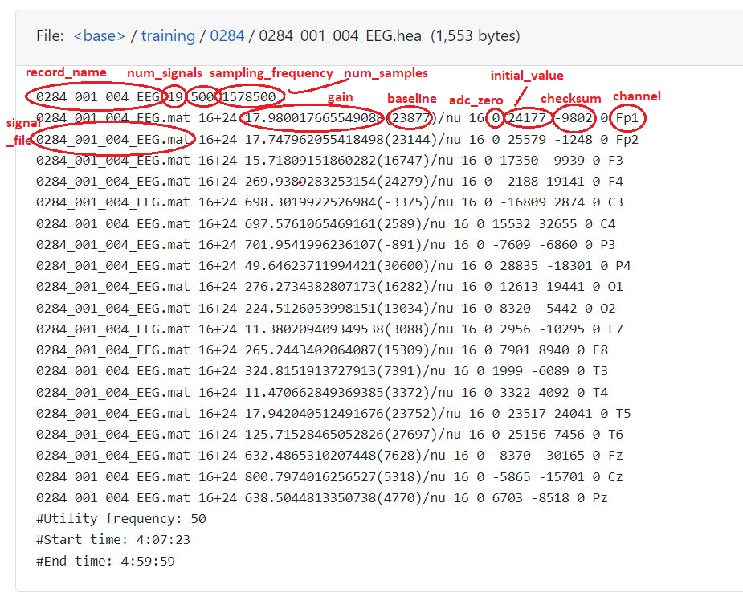

# Physionet-2023_python_example_explanation
In this repo, I aim to explore and offer detailed explanations of the process involved in the "[Physionet 2023 python-example-code](https://github.com/physionetchallenges/python-example-2023)". I will present step-by-step breakdowns of specific components such as helper_code, run_model, train_model, etc. to gain more insight into the coding process. 

The open-source segment of the "[I-CARE dataset](https://physionet.org/content/i-care/2.0/#files)" includes baseline clinical information, continuous electroencephalogram (EEG), and electrocardiogram (ECG) recordings from 607 patients. The provided dataset is structured with a parent folder named 'training,' which contains 607 subfolders. Each subfolder is named based on a patient number, such as '0284'. The contents of each patient folder include various files with different extensions, which we will discuss during the code review.

After installing dependencies using the following 

# 

First of all, we will start with the [helper_code]([https://github.com/physionetchallenges/python-example-2024/blob/main/helper_code.py](https://github.com/physionetchallenges/python-example-2023/blob/master/helper_code.py)):

## 📝 helper_code
In this segment of the Python example code, I will discuss some helper functions that will be utilized during the implementation:

**1- find_data_folders:**
```python
def find_data_folders(root_folder):
    data_folders = list()
    for x in sorted(os.listdir(root_folder)):
        data_folder = os.path.join(root_folder, x)
        if os.path.isdir(data_folder):
            data_file = os.path.join(data_folder, x + '.txt')
            if os.path.isfile(data_file):
                data_folders.append(x)
    return sorted(data_folders))
```
This function is designed to search through "training" parent directory (given by root_folder) to list subdirectories folders in the `data_folders` variable. `data_folders` contains the list of folder names (patient numbers) for which a corresponding .txt file exists inside their respective folder. For instance, if in the directory for patient "0284" there is a file named 0284.txt, then "0284" will be added to the `data_folders` list.


**2- load_challenge_data:**
```python
# Load the patient metadata: age, sex, etc.
def load_challenge_data(data_folder, patient_id):
    patient_metadata_file = os.path.join(data_folder, patient_id, patient_id + '.txt')
    patient_metadata = load_text_file(patient_metadata_file)
    return patient_metadata
```
This function constructs the full path to the patient's metadata file by concatenating `data_folder` (on I-care data structure corresponds to "training" path), `patient_id` (corresponds to patients folder, e.g. "0284"), and the metadata file name (`patient_id + '.txt'`, e.g. 0.284.txt). Then the content of the file is read and returned whenever this function calls (e.g. `load_challenge_data("training", "0284")`) 

**3- find_recording_files:**
```python
# Find the record names
def find_recording_files(data_folder, patient_id):
    record_names = set()
    patient_folder = os.path.join(data_folder, patient_id)
    for file_name in sorted(os.listdir(patient_folder)):
        if not file_name.startswith('.') and file_name.endswith('.hea'):
            root, ext = os.path.splitext(file_name)
            record_name = '_'.join(root.split('_')[:-1])
            record_names.add(record_name)
    return sorted(record_names)
```
This function is designed to identify and list the names of header files with ".hea" regardless of their signal types (e.g. EEG, ECG, and OTHER). Consider the following picture which I took from the data structure of patient "0284" from [I-Care](https://physionet.org/content/i-care/2.1/training/0284/#files-panel) dataset:

<div align="center">

</div>

This function returns the unique names of [0284_001_004, 0284_002_005, 0284_003_006, ..., 0284_085_074] as the `record_names` list

**4- load_recording_data:**
```python
# Load the WFDB data for the Challenge (but not all possible WFDB files).
def load_recording_data(record_name, check_values=False):
    # Allow either the record name or the header filename.
    root, ext = os.path.splitext(record_name)
    if ext=='':
        header_file = record_name + '.hea'
    else:
        header_file = record_name

    # Load the header file.
    if not os.path.isfile(header_file):
        raise FileNotFoundError('{} recording not found.'.format(record_name))

    with open(header_file, 'r') as f:
        header = [l.strip() for l in f.readlines() if l.strip()]
```
This function is designed to load data from the header_file while its existence is confirmed. The code first opens the header file and reads all the lines, strips any leading or trailing whitespace from  each line, and also excludes any empty line. The result is then stored in the list named `header`.

```python
   # Parse the header file.
    record_name = None
    num_signals = None
    sampling_frequency = None
    num_samples = None
    signal_files = list()
    gains = list()
    baselines = list()
    adc_zeros = list()
    channels = list()
    initial_values = list()
    checksums = list()

    for i, l in enumerate(header):
        arrs = [arr.strip() for arr in l.split(' ')]
        # Parse the record line.
        if i==0:
            record_name = arrs[0]
            num_signals = int(arrs[1])
            sampling_frequency = float(arrs[2])
            num_samples = int(arrs[3])
        # Parse the signal specification lines.
        elif not l.startswith('#') or len(l.strip()) == 0:
            signal_file = arrs[0]
            if '(' in arrs[2] and ')' in arrs[2]:
                gain = float(arrs[2].split('/')[0].split('(')[0])
                baseline = float(arrs[2].split('/')[0].split('(')[1].split(')')[0])
            else:                
                gain = float(arrs[2].split('/')[0])
                baseline = 0.0
            adc_zero = int(arrs[4])
            initial_value = int(arrs[5])
            checksum = int(arrs[6])
            channel = arrs[8]
            signal_files.append(signal_file)
            gains.append(gain)
            baselines.append(baseline)
            adc_zeros.append(adc_zero)
            initial_values.append(initial_value)
            checksums.append(checksum)
            channels.append(channel)
```
Consider the above code and the following pictures from the **0284_001_004_EEG.hea** record. The code first initializes various variables and lists that will store information for each signal described in the header:

**First line:** contains the `record_name`, `num_signals`, `sampling_frequency`, and `num_samples`. For example, for the **0284_001_004_EEG.hea** record which picture is shown below, we have: 

*`record_name` = "0284_001_004_EEG" ;  `num_signals` = 19 ;  `sampling_frequency` = 500 Hz ;  `num_samples` = 1578500 (1578500/500 = 3157s = 52 min which is confirming the #Start time: 4:07:23, and #End time: 4:59:59)*

**Subsequent lines:** If the line does not start with '#' and is not empty, the first component is `signal_file`, the third component contains `gain` (before parenthesis) and `baseline` (in parenthesis), the fifth is `adc_zero` (corresponds to the zero voltage level in the analog-to-digital conversion process), the sixth is `initial_value` (initial digital values), the seventh is `checksum` (used for verifying the integrity of the recorded data), and the ninth component is 'channel' (electrode position on the scalp). For example, for the **0284_001_004_EEG.hea** record which picture is shown below, we have:

*`signal_files` = ['0284_001_004_EEG.mat', '0284_001_004_EEG.mat', '0284_001_004_EEG.mat', ...]*

*`gains` = [17.98.0017...., 17.74796..., 15.71809..., ...]*

*`baselines` = [23877.0, 23144.0, 16747.0, ...]*

*`adc_zeros` = [0, 0, 0, ...]*

*`initial_values` = [24177, 25579, 17350, ...]*

*`checksums` = [-9802, -1248, -9939, ...]*

*`channels` = ['Fp1', 'Fp2', 'F3', ...]*

<div align="center">

</div>

```python
    # Check that the header file only references one signal file. WFDB format allows for multiple signal files, but, for
    # simplicity, we have not done that here.
    num_signal_files = len(set(signal_files))
    if num_signal_files!=1:
        raise NotImplementedError('The header file {}'.format(header_file) \
            + ' references {} signal files; one signal file expected.'.format(num_signal_files))
```

The above code ensures that the header file references only one signal file and if there is more than one, it raises an error.

```python
    # Load the signal file.
    head, tail = os.path.split(header_file)
    signal_file = os.path.join(head, list(signal_files)[0])
    data = np.asarray(sp.io.loadmat(signal_file)['val'])
```
The above code loads the signal file (`.mat` format created by MATLAB) and converts it to a 2D NumPy array where each row represents a channel.

The `scipy.io.loadmat` function from the SciPy library is used to read the content of `.mat` file into a Python dictionary, where the keys are the variable names stored in the file, and the values are the corresponding data arrays.
In this case, the signal data is stored under the key 'val'. In other words, the `val` while reading the signal file, refers to a specific variable inside the `.mat` file that contains the actual signal data.

```python
    # Check that the dimensions of the signal data in the signal file is consistent with the dimensions for the signal data given
    # in the header file.
    num_channels = len(channels)
    if np.shape(data)!=(num_channels, num_samples):
        raise ValueError('The header file {}'.format(header_file) \
            + ' is inconsistent with the dimensions of the signal file.')
```
The above code verifies that the dimensions of the signal data match the specifications in the header file.
Given the header file "0284_001_004_EEG.hea" and the corresponding signal file "0284_001_004_EEG.mat", `data` is now a NumPy array with shape **(19, 1578500)**, where 19 is the number of channels and 1578500 is the number of samples per channel.

```python
 # Check that the initial value and checksums in the signal file are consistent with the initial value and checksums in the
    # header file.
    if check_values:
        for i in range(num_channels):
            if data[i, 0]!=initial_values[i]:
                raise ValueError('The initial value in header file {}'.format(header_file) \
                    + ' is inconsistent with the initial value for channel {} in the signal data'.format(channels[i]))
            if np.sum(data[i, :], dtype=np.int16)!=checksums[i]:
                raise ValueError('The checksum in header file {}'.format(header_file) \
                    + ' is inconsistent with the checksum value for channel {} in the signal data'.format(channels[i]))
```

The above code optionally checks that the initial values and checksums (by summing all sample values) match the values specified in the header file. For example, from "0284_001_004_EEG.hea", for channel "Fp1": the initial_values[0] = 24177, and checksums[0] = -9802, if the data[0,0] = 24177, and np.sum(data[0,:], dtype=np.int16) = -9802 then the checks pass since the values match.

```python
    # Rescale the signal data using the gains and offsets.
    rescaled_data = np.zeros(np.shape(data), dtype=np.float32)
    for i in range(num_channels):
        rescaled_data[i, :] = (np.asarray(data[i, :], dtype=np.float64) - baselines[i] - adc_zeros[i]) / gains[i]
```
The above code converts the raw digital values to physical units (voltage) by first subtracting the **baseline** (an offset that was present during the recording. It's essentially the zero-point of the ADC when the input signal is zero) and **ADC_Zero** (representing the value that the ADC considers as zero) and then dividing by **gain** (representing how many digital units correspond to one unit of the physical measurement volts). This process ensures that the zero point in the digital data corresponds to the actual zero point in the physical measurement. For example, for "Fp1" channel: assume data[0, :] = [24177, 24178, ...], as we now baselines[0] = 23877, adc_zeros[0] = 0, gains[0] = 17.980017...; Then the rescaled data calculation for the first sample is (24177-23877-0)/17.980017... = 16.67 (unit, e.g., volts). This means that a raw digital value of 24177 corresponds to approximately 16.68 volts after adjusting for baseline and gain.

# remove_data
This part of the code is designed to selectively copy data files from an input dataset folder to an output folder, excluding `.mat` files. I will provide a detailed explanation of each part in the rest of this section:

This code consists of three functions as follows:

**1- get_parser():**
```python
def get_parser():
    description = 'Remove data from the dataset.'
    parser = argparse.ArgumentParser(description=description)
    parser.add_argument('-i', '--input_folder', type=str, required=True)
    parser.add_argument('-p', '--patient_ids', nargs='*', type=str, required=False, default=[])
    parser.add_argument('-o', '--output_folder', type=str, required=True)
    return parser
```


